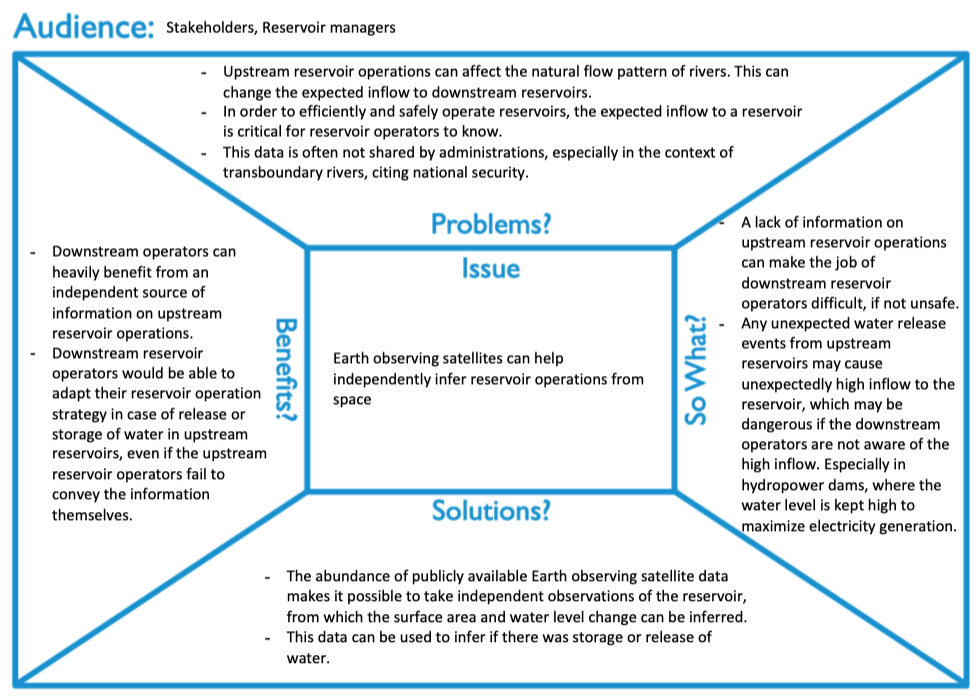
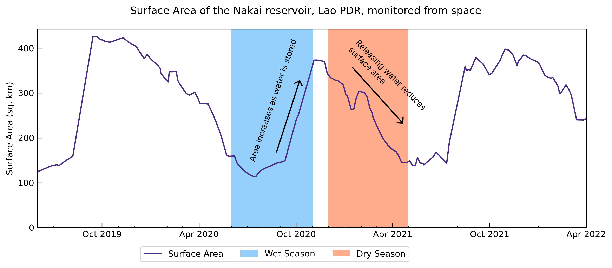

# Message Box

~ Pritam Das

# Figures

## Figure for scientific audience

Figure: Reservoir surface area estimated using the TMS-OS algorithm, that takes advantage of complementary strengths of different satellite sensors. The Synthetic Aperture Radar (SAR) based surface area estiamtes can be underbiased, while the estimates from optical sensors can be noisy in nature. Using the trends of surface area change from a SAR based sensor, the TMS-OS algorithm determines which optical based area estimates to preserve, filtering out the rest of the noisy data. The filtered out data points are then filled using the preserved optically derived area estimates and the surface area change trends from the SAR sensor to obtain a high frequency reservoir surface area time-series.

## Figure for non-scientific audience

Figure: Reservoir surface area of the Nakai reservoir estimated using the TMS-OS algorithm that uses observations from satellite sensors that have complementary strengths. This allows for monitoring of the reservoir state, and infer the oeprations of the reservoir using publicly available satellite observations. For instance, the Nakai reservoir in Lao PDR, where the flood peak is determined by the monsoon season, can be seen to store water during the wet season, as indicated by the rising surface area. The same reservoir then releases water during the rest of the year, during the dry season. These satellite derived surface area estimates can be used to independently quantify the reservoir operation patterns.

# Questions
1. What background knowledge is assumed for the expert figure and the non-expert figure?
    - For the expert figure, it is assumed that they are familiar with different satellite sensor types, and what the strengths and weaknesses are, in the context of measuring the surface area of reservoirs. 
    - It is assumed that the stakeholders are not familiar with the different satellite sensors, but are more informed about the wet-dry season of the region, and what a typical reservoir rule curve (which determines the target water level throughout the year) of a hydroloelectric dam in Lao PDR looks like (storage during wet season, release during dry season).
2. What different aspects of the dataset are accentuated for each target audience?
    - In the expert figure, more information is provided on the algorithm to show cases where satellite based reservoir observation works well (generally true throughout), and where it doesn't (some cases of overfitting).
    - In the non-expert figure, a lot of this information is removed, since details of the algorithm might not be important for the stakeholders, who would be more interested in seeing if it is possible to monitor reservoir operations using satellites. Showing patterns that they are familiar with, such as storage of water or release of water from reservoir, was highlighted in the figure so they can identify the operation patterns from the plot itself - and intuitively get an idea of how satellite based reservoir monitoring might work.
3. What aesthetics are used to create those different emphases in the two figure?
    - Shading and transparency is used in the expert figure to highlight the preserved and filtered out data points. This gives an idea of which data points are determined to be correct by the algorithm, providing insights into the working of the algorithm. Data from different sensors are also plotted, makign use of varying line properties to distinguish from one another.
    - The figure is made much simpler, removing the grids and the data points. This removes the focus from the data points themselves to the surface area change trends through the year. Additionally, shading is performed to show the timing of the wet and dry seasons for this region. 
