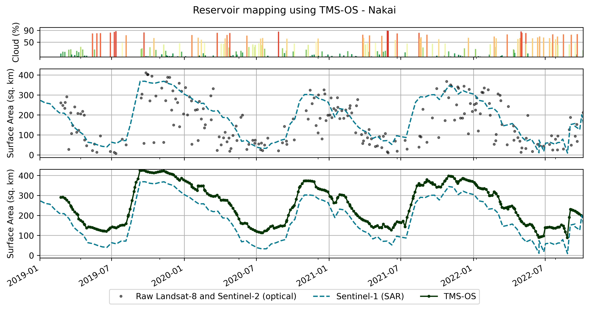
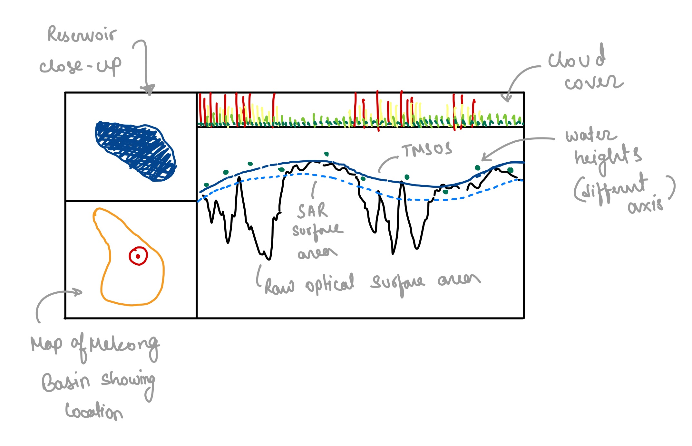

# Project Outline - Hydro Data Visualization - CUAHSI Virtual University
~ Pritam Das

# Data Description
The dataset associated with this repository corresponds to Surface Areas estimated using the Tiered Multi-Sensor - Optical/Sar (TMS-OS) algorithm. The algorithm uses both optically (Landsat 8, 9 and Sentinel 2) and SAR (Sentinel 1) derived surface area estimates to self-correct the water surface area time-series. The idea is to use the strengths of either techonologies to address deficiencies of the other dataset. For instance, optically obtained surface area estimates can be comparatively more accurate during clear days, since SAR estimates tend to udnerestimate surface areas around the boundaries. However, optically derived estimates can get contaminated by clouds and can be unreliable during challenging conditions (atmospheric haze, aglae bloom, high sediment flux), which don't affect the SAR estimates as much (or at all). This complimentary nature of these technologies is taken advantage of in the TMS-OS algorithm. A more detailed description of the almorithm can be found [here, at the recently published paper in the EMS Journal](https://doi.org/10.1016/j.envsoft.2022.105533).

The data used in this project correspond to 36 reservoirs in the Mekong basin, from January 2019 to September 2022

# Question
- How well does the TMS-OS algorithm perform in estimating surface areas?
    - How do the raw optical & SAR, cloud corrected optical (after applying [Zhao and Gao, (2018)](https://doi.org/10.1029/2018GL078343)), and TMS-OS derived surface area estimates compare?

# Draft figures and ideas

The figures shown here are for one (out of 36) reservoir in the Mekong basin, named Nakai (Dam name: Nam Theun), located in Lao PDR.
The goal of the figure is to compare how well does the TMS-OS algorithm perform compared to raw optical based surface area estimates. The raw optical surface areas are also corrected for cloud cover by applying the [Zhao and Gao, (2018)](https://doi.org/10.1029/2018GL078343) algorithm.

## 1. Separate subplots

1. 

2. 

Figure 1: Comparison of TMS-OS derived surface area time-series wth raw optical sensor derived surface area (after applying [Zhao and Gao, (2018)](https://doi.org/10.1029/2018GL078343) cloud correction algorithm). The cloud cover (%) during individual optical measurement is illustrated as colored bars at the top most sub-plot. Surface area estimates using Sentinel-1 (SAR) is also plotted to  illustrate the reason for not using SAR derived surface area estimate. (1.1) which may underestimate the surface area due to vegetation and at the edges of reservoir bodies. (1.2) It can be noted that the optically derived surface areas are more erratic when the cloud cover is high.

## 2. All plots in a single subplot.

1. 

2. 

Figure 2: Comparison of TMS-OS derived surface area time-series wth raw optical sensor derived surface area (after applying [Zhao and Gao, (2018)](https://doi.org/10.1029/2018GL078343) cloud correction algorithm). The cloud cover (%) during individual optical measurement is illustrated as colored bars at the top most sub-plot. Surface area estimates using Sentinel-1 (SAR) is also plotted to  illustrate the reason for not using SAR derived surface area estimate. (2.1) which may underestimate the surface area due to vegetation and at the edges of reservoir bodies. (2.2) It can be noted that the optically derived surface areas are more erratic when the cloud cover is high.

**Visualization Type**:
1. For denoting the cloud-cover, vertical bars are used, which are also color coded. 
2. The surface area estimates are all plotted as line charts, with dots representing the actual observation. The dots were connected via lines to provide a linearly interpolated estimate of surface area during periods of no observation. Connecting the dots with lines also further highlights the sudden dips in surface area, which are not real signals of surface area change.

**Aesthetic choices**:

*Color*
1. The cloud cover percentage is color coded as follows: High cloud cover = Red, Medium (50%) cloud cover = Yellow, and Low cloud cover = Green. Red color usually denotes "bad values", which here is translated as high cloud cover, and *vice versa*. During very high cloud cover (>90%, bright red), optically obtained data is virtually useless, which are filtered out, and can be seen in the plot consecutive subplots.
2. The Sentinel-1 derived surface area is also colored blueish-green so that it can be distinguished from the other data series, which are colored black. The transparency of raw optical time-series is also kept moderately high, since it is not the highlight of the figure, making it appear gray. The transparency of the TMS-OS derived surface area estimate is kept at 0, to highlight that this time-series is the more important element of the plot.

*Line style*
1. The optical and TMS-OS derived surface area estimates are styled as solid lines, while the Sentinel-1 (SAR) time-series is dashed, to further help distinguish between the two. 

*Use of markers*
1. Markers (or dots) are plotted on the line to show the density of available observations. During very high cloud cover (>90%), optically derived surface areas are filtered out, which appear as gaps in the time-series. However, in the TMS-OS derived surfacve area estimate, the markers appear very dense, giving a visual cue to the higher temporal resolution of the product. 

## Future visualization idea

Showing an image of the reservoir and its location may provide more insight into the patterns that are being seen in the comparison of surface area time-series. For instance, 
- Highly irregular boundaries + visible vegetation would highlight the biased nature of SAR derived area estimates. 
- Location in the map can also give an idea of the seasonal cloud cover, highlighting that raw optically derived surface areas will be noisy. 
- The geographical location will also provide further context of the reservoir in question.
- Adding additional data, in the form of water level heights (in a separate axis) may help provide a "proxy" for the "actual reservoir behavior", which would hopefully be closer to the TMS-OS estimates. This would highlight the higher accuracy of the algorithm. 

# One thing I did well
- I think visualizing the cloud cover as bars and also using colors highlights the high cloud cover days very well, both by taking space (vertical bars) and by appearing more red.

# One thing I plan to improve for the final report
- The plot appears busy, and can be further simplified. Possibly the X-labels can be replaced by their month names instead of month numbers. Stylizing the grid lines could also make it more easy to understand, possibly by removing the vertical grid lines and only keeping the horizontal lines.
- Experimenting with other color schemes may also make it more legible - for example, background color of the plot, the color of the text, lines, etc.